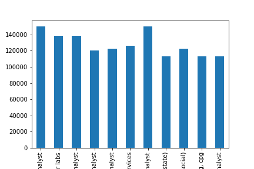
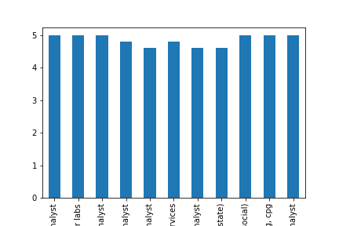

# Data analysis about data analyst jobs

### Table of Contents

1. [Introduction](#Introduction)
2. [Find the best jobs by salary and company rating](#Find the best jobs by salary and company rating)
3. [Explore skills required in job descriptions](#Explore skills required in job descriptions)
4. [Predict salary based on company size](#Predict salary based on company size)
5. [Conclusion](#Conclusion)

## Introduction 

There is a dataset about data analyst jobs. This data would help me because I want to be a data analyst. I want to know some information about this kind of job. I never know about this job and my job experience also dont't contain analyst. So I hope to learn about these jobs by simple analysis. Now I would explore the following 3 questions:

1.Find the best jobs by salary and company rating.

2.Explore skills required in job descriptions.

3.Predict salary based on company size.

## Find the best jobs by salary and company rating 

After cleaning the dataset, I grouped the average salaries and company rating for each job title. 

The best jobs by salary and company rating, the following jobs satisfy the two demand:

ai insights data analyst

data scientist/analyst - wilbur labs

data studio analyst

finance & accounting data analyst

lims master data analyst

senior data analyst, member services

senior hr data analyst

senior marketing data analyst (real estate)

sr digital marketing data analyst (paid social)

sr. data analyst - analytics, marketing, cpg

sr. sales operations & data analyst

From the data, senior level about data science, marketing, hr would be a great job

## Explore skills required in job descriptions 

## Predict salary based on company size 

## Conclusion 